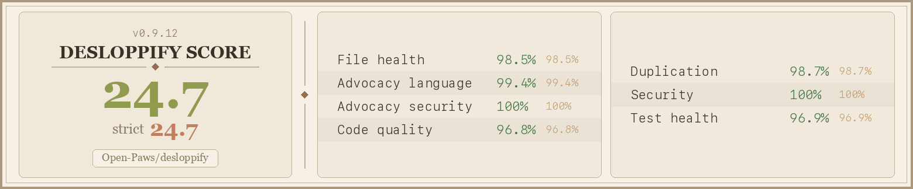

# Desloppify — Open Paws Fork

[Open Paws](https://github.com/Open-Paws) fork of [peteromallet/desloppify](https://github.com/peteromallet/desloppify). Adds advocacy-specific detectors for speciesist language and activist security antipatterns, persona-based browser QA, and Windows platform fixes — while tracking upstream for general improvements.

  [](scorecard.png)

## What Is Desloppify?

A multi-language codebase health scanner that combines mechanical detection (dead code, duplication, complexity, security) with subjective LLM review (naming, abstractions, module boundaries), then works through a prioritized fix loop. State persists across scans so it chips away over multiple sessions, and the scoring resists gaming — the only way up is genuinely better code.

**29 languages supported.** Full plugin depth for TypeScript, Python, C#, C++, Dart, GDScript, Go, and Rust. Generic linter + tree-sitter support for Ruby, Java, Kotlin, and 18 more.

**Overall score = 25% mechanical + 75% subjective.** A score above 98 should correlate with a codebase a seasoned engineer would call beautiful.


## What This Fork Adds

### Advocacy Language Detector — 65 rules

Detects speciesist language patterns in code, comments, and documentation across all 29 supported languages plus `.md`, `.txt`, `.rst` files. Rules are defined in YAML, sourced from [project-compassionate-code](https://github.com/Open-Paws/project-compassionate-code).

| Category | Count | Examples |
|----------|-------|---------|
| Idioms | 30 | "kill two birds with one stone", "beat a dead horse" |
| Metaphors | 21 | "sacred cow", "cash cow", "sacrificial lamb" |
| Insults | 6 | "code monkey", "cowboy coding" |
| Process language | 5 | "nuke", "cull", "kill process" |
| Terminology | 3 | "master/slave", "whitelist/blacklist", "grandfathered" |

Each finding includes a suggested replacement. Context suppression reduces false positives for technical terms (POSIX `kill()`, git `master` branch), proper nouns, and quotations.

### Advocacy Security Detector — 3-adversary threat model

Heuristic detector for activist protection antipatterns based on three adversaries:

- **State surveillance** — ag-gag statutes, warrants, device seizure
- **Industry infiltration** — corporate investigators, social engineering
- **AI model bias** — training data encoding speciesist defaults, telemetry leakage

Detects: identity leakage in logs/errors, sensitive data to external AI APIs without zero-retention headers, investigation materials in public paths, unencrypted writes of sensitive data, IP address logging, sensitive data in browser storage.

### Persona-Based Browser QA

New `persona-qa` command for browser-based testing with configurable persona profiles (YAML). Findings integrate into the standard work queue alongside mechanical and subjective issues.

```bash
desloppify persona-qa --prepare --url https://example.com   # generate agent instructions
# agent runs Playwright, captures findings in JSON
desloppify persona-qa --import findings.json                 # merge into state
desloppify persona-qa --status                               # per-persona summary
desloppify next                                              # persona QA items appear in queue
```

### Windows Platform Fixes

- `input()` blocking in TypeScript logs detector — replaced with `isatty()` guard
- `msvcrt.locking()` infinite wait — replaced with 5s retry timeout (`LK_NBLCK`)
- Dataclass JSON serialization crash on state save — fixed with `dataclasses.asdict()` fallback

### Scoring Dimensions Added

Three new mechanical dimensions (weight 1.0 each):

| Dimension | What it measures |
|-----------|-----------------|
| Advocacy language | Speciesist language in code and docs |
| Advocacy security | Activist protection antipatterns |
| Persona QA | Browser-based usability findings |

## Installation

Requires **Python 3.11+**.

### From the fork (recommended)

```bash
pip install "git+https://github.com/Open-Paws/desloppify.git#egg=desloppify[full]"
```

### From a local clone

```bash
git clone https://github.com/Open-Paws/desloppify.git
cd desloppify
pip install -e ".[full]"
```

### With uvx (no install needed)

```bash
uvx --from "git+https://github.com/Open-Paws/desloppify.git" desloppify scan --path .
```

### Verify installation

```bash
command -v desloppify >/dev/null 2>&1 && echo "desloppify: installed" || echo "NOT INSTALLED"
```

The `[full]` extra includes tree-sitter, PyYAML (for advocacy rules), bandit, Pillow, and defusedxml. For minimal install, drop `[full]` — advocacy detectors will fall back to a built-in YAML parser.

## Quick Start for AI Agents

Paste this into your agent's conversation or system prompt:

```
I want you to improve the quality of this codebase. Install and run desloppify.
Run ALL of the following (requires Python 3.11+):

pip install --upgrade "git+https://github.com/Open-Paws/desloppify.git#egg=desloppify[full]"
desloppify update-skill claude    # installs the full workflow guide
                                  # options: claude, cursor, codex, copilot, droid, windsurf, gemini

Add .desloppify/ to your .gitignore — it contains local state that shouldn't be committed.

Before scanning, exclude noise directories:
desloppify exclude node_modules
desloppify exclude dist
# exclude vendor, build output, generated code, worktrees, etc.

desloppify scan --path .
desloppify next

THE LOOP: run `next`. It tells you what to fix, which file, and the resolve command.
Fix it, resolve it, run `next` again. This is your main job.

Your goal is the highest possible strict score. The scoring resists gaming — the only
way to improve it is to actually make the code better.

Don't be lazy. Large refactors and small detailed fixes — do both with equal energy.
No task is too big or too small. Fix things properly, not minimally.

Use `plan` / `plan queue` to reorder priorities or cluster related issues. Rescan
periodically. The scan output includes agent instructions — follow them.
```

## How It Works — The Full Agent Workflow

### Phase 1: Scan — understand the codebase

```bash
desloppify scan --path .       # runs all mechanical detectors (including advocacy)
desloppify status              # check scores
```

The scan will tell you if subjective dimensions need review. Follow its instructions.

### Phase 2: Review — score subjective dimensions (75% of the score)

```bash
desloppify review --prepare    # generates blind review packet
# launch subagents to score dimensions against the blind packet
desloppify review --import merged.json --scan-after-import
```

Subjective scores start at 0% until reviewed. This is where most of the score lives.

### Phase 3: Plan — triage and order the queue

```bash
desloppify next                # shows top-priority execution item
desloppify plan                # see the living plan
desloppify plan queue          # compact execution queue view
desloppify plan reorder <pat> top       # reorder priorities
desloppify plan cluster create <name>   # group related issues
```

### Phase 4: Execute — grind the queue

```bash
git checkout -b desloppify/code-health

# The loop:
desloppify next                          # 1. get next item
# fix the code                           # 2. make the change
# run the resolve command next shows     # 3. mark it done
git add <files> && git commit -m "..."   # 4. commit when logical
desloppify plan commit-log record        # 5. record the commit
desloppify next                          # 6. repeat
```

When the queue is empty, go back to Phase 1. New issues will surface, cascades will resolve, priorities will shift.

## Command Reference

| Command | Purpose |
|---------|---------|
| `scan --path .` | Analyze codebase, save findings |
| `status` | Summary of scores and dimension health |
| `next` | Top-priority item from execution queue |
| `backlog` | All open work items |
| `plan` | View/manage the living plan |
| `plan queue` | Compact execution queue |
| `plan reorder` | Reorder priorities |
| `plan cluster` | Group related issues |
| `resolve` | Mark issues fixed |
| `autofix` | Auto-fix (when available) |
| `review --prepare` | Generate blind review packet |
| `review --import` | Import review scores |
| `show <pattern>` | Display specific findings |
| `suppress` | Suppress false positives |
| `exclude <path>` | Exclude paths from scanning |
| `persona-qa` | Browser QA persona testing |
| `update-skill <agent>` | Generate agent skill file |
| `config` | Show/edit configuration |
| `directives` | Agent lifecycle directives |
| `viz` / `tree` | Dependency graph visualization |
| `langs` | Show supported languages |

## Advocacy Guidance for Agents

When fixing issues from the advocacy detectors, follow this guidance.

### Fixing Speciesist Language

Replace the flagged term with the first suggested alternative. Don't add comments explaining why. Don't wrap in feature flags. Just change it.

### Fixing Security Antipatterns

- **Identity leakage**: Remove PII from log/error output. Use pseudonymous identifiers. Never log IP, email, or real names in the same statement.
- **External API calls**: Add zero-retention headers or route through self-hosted inference.
- **Public path exposure**: Move investigation/evidence data out of `public`/`static` directories. Use encrypted storage.

### Ubiquitous Language

Use these terms correctly in code, comments, and commit messages:

| Term | Meaning | NOT |
|------|---------|-----|
| Campaign | Coordinated advocacy action | Marketing campaign |
| Investigation | Covert evidence gathering | Bug investigation |
| Coalition | Cross-org partnership | Generic collaboration |
| Witness | Person providing testimony | Test witness |
| Sanctuary | Rescue facility for animals | Sandbox |
| Companion animal | Animal living with humans | Pet |
| Farmed animal | Animal in agriculture | Livestock |

## Upstream Tracking

This fork tracks `peteromallet/desloppify` as `upstream`. Fork-specific changes live in new files (advocacy detectors, persona QA command) and minimal patches to scoring constants and language configs. Upstream merges should be clean.

```bash
git fetch upstream
git merge upstream/main
```

## Code Quality



## Contributing

Issues and PRs go to [github.com/Open-Paws/desloppify](https://github.com/Open-Paws/desloppify).

For upstream bugs unrelated to the advocacy extensions, file at [github.com/peteromallet/desloppify](https://github.com/peteromallet/desloppify).

## License

MIT — same as upstream.
