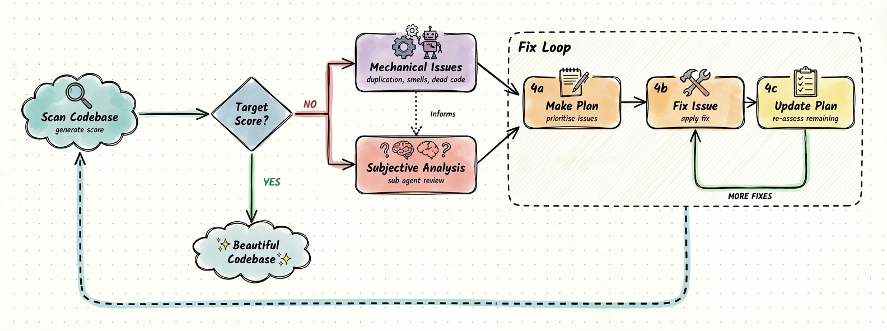

[](https://pypi.org/project/desloppify/) [](LICENSE) [](https://www.python.org/downloads/) [](https://github.com/Open-Paws/desloppify/commits/main)

# Desloppify — Open Paws Fork

A multi-language codebase health scanner that combines mechanical detection (dead code, duplication, complexity, security) with LLM-based subjective review (naming, abstractions, module boundaries), then works through a prioritized fix loop. This Open Paws fork adds 65 advocacy language rules, a 3-adversary activist security detector, and persona-based browser QA — all integrated into the same scoring and queue system as the upstream detectors.

> [!NOTE]
> This project is part of the [Open Paws](https://openpaws.ai) ecosystem — AI infrastructure for the animal liberation movement. [Explore the full platform →](https://github.com/Open-Paws)



## Quickstart

Requires **Python 3.11+**.

```bash
# Install from this fork
pip install "git+https://github.com/Open-Paws/desloppify.git#egg=desloppify[full]"

# Exclude generated directories, then scan
desloppify exclude node_modules dist
desloppify scan --path .

# Run the fix loop: next → fix → resolve → repeat
desloppify next
```

Or without installing:

```bash
uvx --from "git+https://github.com/Open-Paws/desloppify.git" desloppify scan --path .
```

Add `.desloppify/` to `.gitignore` — it holds local state that should not be committed.

## Features

### Scoring model

Overall score = **25% mechanical + 75% subjective**. A score above 98 correlates with a codebase a seasoned engineer would call well-crafted. The scoring resists gaming — the only path upward is genuinely better code.

**Mechanical pool (25% of overall)**

| Dimension | Weight |
|-----------|--------|
| File health | 2.0 |
| Code quality | 1.0 |
| Duplication | 1.0 |
| Test health | 1.0 |
| Security | 1.0 |
| Advocacy language *(fork addition)* | 1.0 |
| Advocacy security *(fork addition)* | 1.0 |
| Persona QA *(fork addition)* | 1.0 |

**Subjective pool (75% of overall)** — scored by an LLM against a blind review packet. Includes high/mid/low elegance, contracts, type safety, design coherence, abstraction fit, logic clarity, naming quality, and more.

**Minimum score thresholds** (Open Paws internal policy):
- Gary (autonomous agent): ≥ 80
- Platform repos: ≥ 75
- All other repos: ≥ 70

### Language support

**29 languages.** Full plugin depth for TypeScript, Python, C#, C++, Dart, GDScript, Go, and Rust. Generic linter + tree-sitter support for Ruby, Java, Kotlin, and 18 more.

### Fork additions

**Advocacy language detector — 65 rules**

Detects speciesist language in code, comments, and documentation across all 29 languages plus `.md`, `.txt`, `.rst`. Rules sourced from [no-animal-violence](https://github.com/Open-Paws/no-animal-violence).

| Category | Count | Examples |
|----------|-------|---------|
| Idioms | 30 | "kill two birds with one stone", "beat a dead horse" |
| Metaphors | 21 | "sacred cow", "cash cow", "sacrificial lamb" |
| Insults | 6 | "code monkey", "cowboy coding" |
| Process language | 5 | "nuke", "cull", "kill process" |
| Terminology | 3 | "master/slave", "whitelist/blacklist" |

Each finding includes a suggested replacement. Context suppression reduces false positives for technical terms (POSIX `kill()`, git `master` branch), proper nouns, and quotations.

**Advocacy security detector — 3-adversary threat model**

Heuristic detection for activist protection antipatterns against three adversaries:

- **State surveillance** — ag-gag statutes, warrants, device seizure
- **Industry infiltration** — corporate investigators, social engineering
- **AI model bias** — training data encoding speciesist defaults, telemetry leakage

Detects: identity leakage in logs/errors, sensitive data routed to external AI APIs without zero-retention headers, investigation materials in public paths, unencrypted writes of sensitive data, IP address logging, sensitive data in browser storage.

**Persona-based browser QA**

```bash
desloppify persona-qa --prepare --url https://example.com   # generate agent instructions
# agent runs browser testing and captures findings in JSON
desloppify persona-qa --import findings.json                 # merge into state
desloppify persona-qa --status                               # per-persona summary
desloppify next                                              # persona QA items appear in queue
```

**Windows platform fixes**

- `input()` blocking in TypeScript logs detector replaced with `isatty()` guard
- `msvcrt.locking()` infinite wait replaced with 5-second retry timeout
- Dataclass JSON serialization crash on state save fixed with `dataclasses.asdict()` fallback

### Fix loop

```bash
desloppify next          # get the top-priority item; it shows which file and the resolve command
# fix the code
desloppify plan resolve  # mark it done
desloppify next          # get the next item
```

State persists across sessions in `.desloppify/` so the tool chips away over multiple runs.

## Documentation

| Document | Purpose |
|----------|---------|
| [docs/SKILL.md](docs/SKILL.md) | Full agent workflow guide (scan → review → plan → execute) |
| [docs/CLAUDE.md](docs/CLAUDE.md) | Claude Code integration |
| [docs/CURSOR.md](docs/CURSOR.md) | Cursor integration |
| [docs/CODEX.md](docs/CODEX.md) | OpenAI Codex integration |
| [docs/GEMINI.md](docs/GEMINI.md) | Gemini integration |
| [docs/WINDSURF.md](docs/WINDSURF.md) | Windsurf integration |
| [docs/QUEUE_LIFECYCLE.md](docs/QUEUE_LIFECYCLE.md) | Queue and plan lifecycle |
| [desloppify-fork-architecture.md](desloppify-fork-architecture.md) | Fork architecture and extension points |
| [persona-qa-architecture.md](persona-qa-architecture.md) | Persona QA design |

Install agent skill files directly from the CLI:

```bash
desloppify update-skill claude    # options: claude, cursor, codex, copilot, droid, windsurf, gemini
```

## Architecture

<details>
<summary>Internal structure</summary>

The package is organized into five main layers:

**`desloppify/languages/`** — per-language configs. Each language is a `LangConfig` dataclass with ordered `DetectorPhase` callables, dependency graph builder, function extractor, and subjective review dimensions. Full plugin depth: TypeScript, Python, C#, C++, Dart, GDScript, Go, Rust. Generic support via tree-sitter for 21 more languages.

**`desloppify/engine/`** — scoring, plan, work queue, and scan workflow. Scoring uses two pools (mechanical 25%, subjective 75%) with per-dimension weighted averages and sample dampening for small codebases. Plan and queue state persist in `.desloppify/` with file locking for safe concurrent access.

**`desloppify/intelligence/`** — subjective review logic. Prepares blind review packets and normalizes LLM assessment output into the same `Issue` format as mechanical detectors. Never calls an LLM directly — model selection happens at the orchestration layer, keeping this layer model-agnostic.

**`desloppify/app/`** — CLI commands and orchestration. Each command (`scan`, `next`, `review`, `persona-qa`, etc.) lives in its own subdirectory. The command registry is a plain dict mapping.

**`desloppify/base/`** — detector metadata catalog (65+ built-in entries), scoring policy registry, and the `DetectorMeta` / `LangConfig` type contracts.

**Fork-specific files:**
- `desloppify/engine/detectors/advocacy_language.py` — shells out to semgrep/eslint/vale for the 65-rule advocacy language check
- `desloppify/engine/detectors/advocacy_security.py` — heuristic activist security checks
- `desloppify/app/commands/persona_qa/` — browser QA command and persona profile handling

**Upstream tracking:**

This fork tracks [`peteromallet/desloppify`](https://github.com/peteromallet/desloppify) as `upstream`. Fork-specific changes live in new files and minimal patches to scoring constants and language configs. Upstream merges are designed to stay clean.

```bash
git fetch upstream
git merge upstream/main
```

</details>

## Contributing

Issues and pull requests go to [github.com/Open-Paws/desloppify](https://github.com/Open-Paws/desloppify).

For bugs in the upstream scanner unrelated to the advocacy extensions, file at [github.com/peteromallet/desloppify](https://github.com/peteromallet/desloppify).

Contributions to the advocacy language rules (new patterns, replacements, context suppressions) are especially welcome — the rule set lives in [Open-Paws/no-animal-violence](https://github.com/Open-Paws/no-animal-violence) and is shared across the full tooling suite (semgrep, ESLint, Vale, pre-commit, GitHub Actions).

If you maintain an open-source project and want to add compassionate language checks, see [project-compassionate-code](https://github.com/Open-Paws/project-compassionate-code) for the broader initiative.

## License

MIT — same as upstream. See [LICENSE](LICENSE).

**Upstream:** [peteromallet/desloppify](https://github.com/peteromallet/desloppify) by Peter O'Malley.

**Advocacy rules:** [Open-Paws/no-animal-violence](https://github.com/Open-Paws/no-animal-violence).

---

<!-- tech_stack: Python, semgrep, ESLint, Vale, tree-sitter -->
<!-- project_status: active -->
<!-- difficulty: intermediate -->
<!-- skill_tags: code-quality, static-analysis, advocacy-language, security, browser-qa -->
<!-- related_repos: no-animal-violence, project-compassionate-code, gary, platform -->

[Donate](https://openpaws.ai/donate) · [Discord](https://discord.gg/openpaws) · [openpaws.ai](https://openpaws.ai) · [Volunteer](https://openpaws.ai/volunteer)
